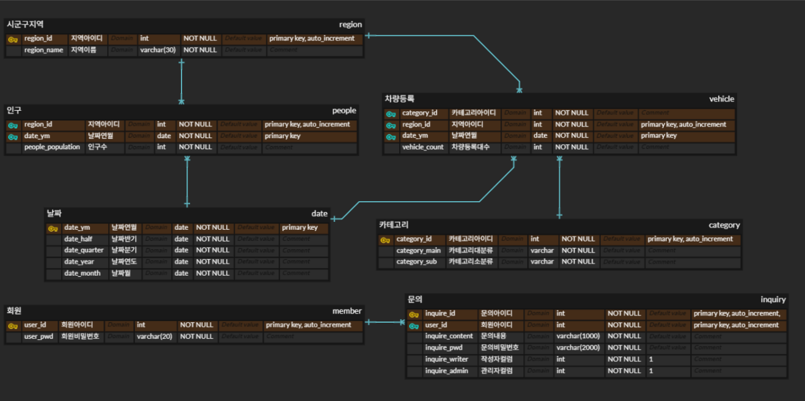

# SKN36-1st-2team

<div align="center">

# 🚚 WAYLOGI

### 화물차 등록 데이터 기반 물류 거점 분석 서비스

**전국 249개 시군구의 자동차·인구 데이터를 통합해 — 물류·운송 기업을 위한 입지 분석 시스템**


<br>

<!-- 👇 시연 GIF 를 이 자리에 넣어주세요 -->
<sub>📽️ 시연 GIF 삽입 예정 &nbsp;·&nbsp; 중요도 진단 → 가중치 산출 → 유망지역 순위 → 근거 확인</sub>

</div>

---

## 📑 목차

1. [팀 소개](#-팀-소개)
2. [프로젝트 개요](#-프로젝트-개요)
3. [개발 배경 & 문제의식](#-개발-배경--문제의식)
4. [핵심 기능](#-핵심-기능)
5. [물류 거점 점수 산출 방식](#-물류-거점-점수-산출-방식)
6. [기술 스택](#-기술-스택)
7. [시스템 아키텍처](#-시스템-아키텍처)
8. [데이터 설계 & ERD](#-데이터-설계--erd)
9. [화면 구성](#-화면-구성)
10. [프로젝트 구조](#-프로젝트-구조)
11. [실행 방법](#-실행-방법)
12. [ETL 재적재가 필요한 경우](#-etl-재적재가-필요한-경우)
13. [DB 마이그레이션](#-db-마이그레이션)
14. [제약사항](#-제약사항)
15. [향후 계획](#-향후-계획)

---

## 👥 팀 소개

**SKN 36기 2팀**

| 프로필 | 이름 | 역할 | 담당 | GitHub |
|---|---|---|---|---|
| | | | | |
| | | | | |
| | | | | |
| | | | | |

---

## 📌 프로젝트 개요

**WAYLOGI**는 전국 249개 시군구의 화물차 등록 데이터와 인구 데이터를 결합해, 물류·운송 기업이 **다음 거점을 어디에 둘지** 판단할 수 있도록 돕는 데이터 분석 서비스입니다.

상권 분석 중심의 기존 입지 서비스와 달리 **화물의 이동**에 초점을 맞추며, 사용자가 직접 설정한 기준에 따라 유망 입지 후보의 순위가 재산출됩니다.

- **프로젝트명** : 화물차 등록 데이터 기반 물류 거점 분석 서비스 (WAYLOGI)
- **분석 대상** : 전국 249개 시군구
- **분석 기간** : 2023.07 ~ 2026.07 (37개월, 월 단위)
- **한 줄 소개** : 데이터로 찾는 우리 회사의 다음 물류 거점

```
[자동차 등록 현황]  +  [지역별 인구]  +  [행정구역 코드]
                        │
              지역 · 연월 기준 통합
                        │
    산업성 · 성장성 · 수요성 산출 → 사용자 가중치 반영 → 유망 입지 후보 순위 · 근거
```

---

## 🧭 개발 배경 & 문제의식

물류 기업이 새 거점을 검토할 때 가장 먼저 하는 일은 지역별 화물 현황을 파악하는 것입니다. 그런데 이 과정이 생각보다 번거롭습니다.

화물차 등록 현황은 국토교통부에, 인구 통계는 행정안전부에, 행정구역 정보는 또 다른 곳에 있습니다. 세 자료를 각각 내려받아 지역명과 기간을 맞추는 작업부터 시작해야 합니다. 게다가 공공 통계는 원본 수치만 제공하기 때문에, 증가율이나 비중처럼 실제로 비교에 필요한 지표는 직접 계산해야 합니다.

기존 입지 분석 서비스가 있긴 하지만 대부분 상권·출점 분석에 맞춰져 있습니다. 유동인구와 매출을 중심으로 보기 때문에, 화물차가 어디에 얼마나 있는지를 기준으로 판단하려는 기업에게는 맞지 않습니다.

그래서 화물차 데이터를 중심에 두고, **조회부터 비교·분석·추천까지 하나의 흐름으로 처리하는 서비스**를 만들기로 했습니다. 공공데이터를 수집·정제해 MySQL에 적재하고, Streamlit 대시보드에서 지역 조회·시계열 분석·거점 점수 산출·유망지역 추천을 제공합니다.

다만 분석 결과는 **최적 입지가 아닌 유망 입지 후보**로 제시합니다. 교통망·물동량·임대료처럼 실제 입지 결정에 크게 작용하는 요인들이 이 데이터에는 담겨 있지 않기 때문입니다. 이 한계는 서비스 화면에도 그대로 표시했습니다.

---

## 🎯 핵심 기능

| 기능 | 설명 |
|---|---|
| 🔍 **지역별 등록 현황 조회** | 시군구·기간·용도별 화물차 등록 현황을 표와 지도로 조회 |
| 📈 **시계열 추이 분석** | 37개월 월별 데이터로 증가율·추세·연속 증가 개월 수 분석 |
| 🧮 **물류 거점 점수 산출** | 산업성·성장성·수요성 3개 축을 백분위로 환산해 종합 점수 계산 |
| 🎚 **중요도 진단 · 맞춤 가중치** | 선택형 문항 5개 응답으로 사용자별 가중치 산출 |
| 🏆 **유망 입지 후보 추천** | 종합 점수 순위와 항목별 산출 근거를 함께 제시 |
| 🗺 **지도 기반 검색·시각화** | 249개 시군구 경계 지도에서 검색·선택·비교 |
| 💬 **FAQ · 문의** | 지표 해석 FAQ 조회 및 사용자 문의 등록 |

---

## 🧮 물류 거점 점수 산출 방식

세 가지 축을 각각 산출한 뒤, 사용자가 설정한 가중치로 합산합니다.

| 축 | 질문 | 사용 지표 |
|---|---|---|
| **산업성** | 물류 산업 기반과 특화 정도가 높은 지역인가? | 영업용 화물차 비중 · 입지계수(LQ) · 인구 1천 명당 화물차 |
| **성장성** | 앞으로 물류 수요가 성장할 가능성이 높은 지역인가? | 화물차 전년동월비 · 12개월 가속도 · 추세 지속성<br>영업용 전환율 · 인구-화물 디커플링 · 안정성 |
| **수요성** | 잠재적인 물류 수요 규모가 큰 지역인가? | 자체 인구 · 인구 밀도 · 인구 증가율 |

### 산출 과정

```
① 세부지표 산출        지역별 원본 데이터에서 각 지표를 계산
② 백분위 변환          249개 시군구 기준 0~100 점수로 환산
③ 축별 점수 산출        산업성 · 성장성 · 수요성 각각 평균
④ 사용자 가중치 반영    종합점수 = 산업성 × w₁ + 성장성 × w₂ + 수요성 × w₃   (w₁+w₂+w₃ = 1)
```

| 항목 | 내용 |
|---|---|
| **정규화** | 백분위(0~100)로 환산합니다. min-max 방식은 이상치 하나에 크게 흔들리기 때문입니다. |
| **축별 평균** | 계산 가능한 세부지표의 점수를 동일 비중으로 평균합니다. |
| **표본 기준** | 화물차 등록대수 500대 미만 지역은 증가율이 과대 표시되므로 순위 산출에서 제외합니다. |
| **결측 처리** | 결측 월은 보간하지 않고 `–` 로 표기합니다. |

> 관련 구현은 `web/backend/scoring.py` 에 있습니다.

---

## 🛠 기술 스택

| 구분 | 기술 |
|---|---|
| **Frontend** |    |
| **Backend** |   |
| **Database** |   |
| **Environment** |   |
| **협업** |   |
| **데이터 출처** | 국토교통부 자동차등록현황보고(시군구별), 행정안전부 주민등록 인구통계, 공공데이터포털 |

---

## 🏗 시스템 아키텍처

WAYLOGI는 **Streamlit 기반 화면에서 MySQL 데이터를 조회하고, Python 서비스 계층에서 지역별 물류 지표와 추천 점수를 계산하는 웹 애플리케이션**입니다.

```text
사용자
  │
  ▼
Streamlit Frontend
  ├─ app.py                       서비스 소개 · 전국 요약 지표
  ├─ pages/data_search.py         데이터 조회 · 지도 · 지역 상세
  ├─ pages/recommend.py           중요도 진단 · 유망지역 순위
  └─ pages/inquiry.py             FAQ · 문의
  │
  ▼
Backend Service Layer
  ├─ web/backend/services.py      조회 결과 조합 · 추천 순위 계산 · 문의 검증
  ├─ web/backend/scoring.py       산업성·성장성·수요성 · 백분위 정규화 · 가중 합산
  ├─ web/backend/queries.py       지역·인구·차량 조회 및 문의 등록 SQL
  └─ web/backend/db.py            환경변수 로드 · MySQL 연결 · 트랜잭션
  │
  ▼
MySQL 8.4 Database
  ├─ region        시군구 코드 · 지역명 · 면적(km²)
  ├─ date          연월 · 반기 · 분기 · 연 · 월
  ├─ category      차량 대분류 · 소분류
  ├─ people        지역 · 연월별 인구수
  ├─ vehicle       지역 · 연월 · 차종별 등록대수
  ├─ admin         관리자 계정
  └─ inquiry       문의 게시판
  ▲
  │
  ├─ database/01_schema.sql       DB 및 테이블 생성
  ├─ database/02_seed.sql         초기 분석 데이터 적재
  ├─ database/migrations/         기존 DB 대상 수동 마이그레이션
  └─ etl/load_data.py             Excel 기반 분석 데이터 재적재
```

### 주요 파일 역할

| 파일 | 역할 |
|---|---|
| `app.py` | 메인 화면에 전국 화물차 등록대수, 전년 동월 대비 증가율, 분석 대상 지역 수 등을 표시 |
| `pages/data_search.py` | 전국·시도·시군구 데이터 조회, 지도, 지역 상세 지표 및 기간별 추이 표시 |
| `pages/recommend.py` | 사용자 가중치를 반영하여 지역 점수와 추천 순위 계산 및 표시 |
| `pages/inquiry.py` | FAQ 조회 및 문의 입력·등록 처리 |
| `ui/backend.py` | MySQL 연결 객체를 Streamlit 리소스로 캐싱 |
| `ui/layout.py` | 공통 레이아웃 · 내비게이션 · CSS 주입 |
| `ui/charts.py` | 추이 · 구성비 · 순위 차트 |
| `web/backend/db.py` | 환경변수 로드, MySQL 연결, 조회·등록·트랜잭션 처리 |
| `web/backend/queries.py` | 지역·인구·차량 조회 및 문의 등록 SQL 정의 |
| `web/backend/services.py` | 조회 결과 조합, 추천 순위 계산, 문의 검증·등록 |
| `web/backend/scoring.py` | 산업성·성장성·수요성 계산, 백분위 정규화, 사용자 가중 최종 점수 계산 |
| `database/01_schema.sql` | `logistics_db` 및 서비스·분석 테이블 생성 |
| `database/02_seed.sql` | 초기 분석 데이터 적재 |
| `etl/load_data.py` | Excel 원본을 검증·변환하여 분석 테이블 재구축 |

---

## 🗄 데이터 설계 & ERD

### 테이블 구성

| 구분 | 테이블 | 역할 |
|---|---|---|
| 기준 정보 | `region` | 시군구 코드 · 지역명 · 면적(km²) |
| 기준 정보 | `date` | 연월과 반기·분기·연·월 |
| 기준 정보 | `category` | 차량 대분류·소분류 |
| 수치 데이터 | `vehicle` | 지역·연월·차종별 등록대수 |
| 수치 데이터 | `people` | 지역·연월별 인구수 |
| 서비스 | `admin` · `inquiry` | 관리자 계정과 문의 게시판 |

> `vehicle` 한 행은 **"어느 시군구의 · 어느 연월에 · 어떤 차종이 · 몇 대"** 를 의미합니다.

### ERD

<div align="center">



</div>

| 구분 | 테이블 | 기본키 |
|---|---|---|
| 기준 | `region` | `region_id` |
| 기준 | `date` | `date_ym` |
| 기준 | `category` | `category_id` |
| 수치 | `vehicle` | `category_id` + `region_id` + `date_ym` (복합키) |
| 수치 | `people` | `region_id` + `date_ym` (복합키) |
| 서비스 | `admin` | `admin_id` |
| 서비스 | `inquiry` | `inquiry_id` |

> `vehicle` 과 `people` 은 복합키를 사용해 **같은 지역·같은 연월·같은 차종의 중복 적재를 구조적으로 차단**합니다.
> ERD 원본 파일은 `docs/erd/` 에 있습니다.

---

## 🖥 화면 구성

| 경로 | 화면 | 설명 |
|---|---|---|
| `/` | **서비스 소개** | 서비스 소개, 전국 요약 지표, 진입 안내 |
| `/data_search` | **데이터 조회** | 전국 추이·용도별 구성 ↔ 시군구 지도·검색·비교 |
| `/recommend` | **유망지역 추천** | 중요도 진단 5문항 → 가중치 반영 순위 → 항목별 근거 |
| `/inquiry` | **FAQ · 문의** | FAQ 조회 및 사용자 문의 등록 |

<!-- 👇 화면 캡처를 이 자리에 넣어주세요 -->
<!--  -->

---

## 🗂 프로젝트 구조

```text
SKN36-1st-2team/
├── app.py                              서비스 소개 (메인)
│
├── pages/
│   ├── data_search.py                  데이터 조회 · 지도 · 지역 상세
│   ├── recommend.py                    중요도 진단 · 유망지역 순위
│   └── inquiry.py                      FAQ · 문의
│
├── web/
│   └── backend/
│       ├── db.py                       환경변수 · MySQL 연결 · 트랜잭션
│       ├── queries.py                  조회·등록 SQL 정의
│       ├── services.py                 결과 조합 · 순위 계산 · 문의 검증
│       ├── scoring.py                  지표 계산 · 백분위 정규화 · 가중 합산
│       └── test_*.py                   백엔드 단위 테스트
│
├── ui/
│   ├── backend.py                      MySQL 연결 캐싱
│   ├── layout.py                       공통 레이아웃 · nav · CSS 주입
│   └── charts.py                       추이 · 구성비 · 순위 차트
│
├── database/
│   ├── docker-compose.yml              MySQL 8.4 컨테이너 정의
│   ├── 01_schema.sql                   DB 및 테이블 생성
│   ├── 02_seed.sql                     초기 분석 데이터 적재
│   ├── migrations/                     기존 DB 대상 수동 마이그레이션
│   └── mysql_data/                     (gitignore) 데이터 볼륨
│
├── etl/
│   ├── load_data.py                    Excel → 분석 테이블 재적재
│   ├── build_seed_from_excel.py        Excel → seed SQL 생성
│   ├── export_seed.py                  DB → seed SQL 내보내기
│   ├── region_area.py                  admdongkor 기반 시군구 면적 산출
│   ├── update_region_areas.py          region.area_km2 갱신
│   └── data/
│       ├── 자동차등록현황_데이터셋.xlsx
│       └── 전국_인구데이터_전처리완료.xlsx
│
├── assets/
│   └── css/                            base · main · components · charts · explore · recommend · inquiry
│
├── docs/
│   └── erd/                            ERD 이미지 · 원본
│
├── .env.example
├── .env                                (gitignore)
├── pyproject.toml
├── uv.toml
├── uv.lock
└── README.md
```

---

## 🚀 실행 방법

> 아래 절차는 **GitHub에서 처음 Clone한 신규 환경**을 기준으로 합니다.
> 명령어는 별도 안내가 없는 한 **프로젝트 루트**에서 실행합니다.

### 1. 사전 준비

| 프로그램 | 비고 |
|---|---|
| Git | |
| Docker Engine · Docker Compose | MySQL 컨테이너 실행 |
| `uv` | Python 패키지 관리 |
| Python 3.13 이상 | |

### 2. 저장소 Clone

```bash
git clone https://github.com/SKNETWORKS-FAMILY-AICAMP/SKN36-1st-2team.git
cd SKN36-1st-2team
```

### 3. Python 환경 및 패키지 설치

```bash
uv sync --locked
```

> `uv.lock` 을 기준으로 가상환경 `.venv` 에 필요한 패키지를 설치합니다.
> 이후 실행은 `uv run` 을 사용하므로 `.venv` 를 별도로 활성화하지 않아도 됩니다.

### 4. 환경변수 설정

프로젝트 루트의 `.env.example` 을 복사해 `.env` 를 생성합니다.

**macOS / Linux**

```bash
cp .env.example .env
```

**Windows PowerShell**

```powershell
Copy-Item .env.example .env
```

**기본 환경변수** (Docker 기본 설정 기준)

```env
DB_HOST=localhost
DB_PORT=3307
DB_USER=root
DB_PASSWORD=root1234
DB_NAME=logistics_db
```

> Docker Compose가 `3307:3306` 으로 설정되어 있어 호스트에서는 **3307** 포트를 사용합니다.

### 5. MySQL 실행 및 초기화

```bash
docker compose -f database/docker-compose.yml up -d
```

**컨테이너 상태 확인**

```bash
docker compose -f database/docker-compose.yml ps
```

**MySQL 연결 상태 확인**

```bash
docker compose -f database/docker-compose.yml exec db mysqladmin ping -h localhost -uroot -proot1234
```

신규 환경에서 `database/mysql_data/` 가 비어 있으면 최초 실행 시 다음이 순서대로 자동 실행됩니다.

| 순서 | 파일 | 내용 |
|---|---|---|
| 1 | `database/01_schema.sql` | `logistics_db` 생성, 서비스 및 분석 테이블 생성 |
| 2 | `database/02_seed.sql` | 지역·날짜·카테고리·인구·차량 데이터 적재 |

> 초기 데이터가 많아 최초 실행 시 시간이 걸릴 수 있습니다.
> 초기화 스크립트는 데이터 디렉터리가 비어 있는 **최초 1회만** 자동 실행됩니다.

### 6. Streamlit 실행

MySQL 초기화가 완료된 후 실행합니다.

```bash
uv run streamlit run app.py
```

브라우저에서 `http://localhost:8501` 로 접속합니다.

### 빠른 실행 요약

```text
Clone  →  uv sync --locked  →  .env.example → .env  →  Docker / MySQL 실행
      →  01_schema.sql 자동 실행  →  02_seed.sql 자동 실행
      →  uv run streamlit run app.py  →  http://localhost:8501
```

---

## 🔄 ETL 재적재가 필요한 경우

일반적인 실행 과정에서는 `etl/load_data.py` 를 실행하지 않습니다. Docker 초기화 과정에서 `02_seed.sql` 이 필요한 분석 데이터를 자동으로 적재합니다.

다음과 같은 경우에만 선택적으로 실행합니다.

- `etl/data/자동차등록현황_데이터셋.xlsx` 가 변경된 경우
- `etl/data/전국_인구데이터_전처리완료.xlsx` 가 변경된 경우
- Excel 원본을 기준으로 분석 데이터를 다시 구축해야 하는 경우

```bash
uv run python etl/load_data.py
```

> 실행 시 `region`, `date`, `category`, `people`, `vehicle` 테이블을 다시 생성하고 데이터를 재적재합니다.
> 일반적인 애플리케이션 실행 과정에서는 반복 실행하지 않습니다.

---

## 🧩 DB 마이그레이션

> ⚠️ **신규 환경에서는 실행하지 않습니다.**
> `01_schema.sql` + `02_seed.sql` 만으로 최신 상태가 됩니다.

`database/migrations/` 스크립트는 이미 만들어 둔 **기존 Docker 볼륨**을 최신 스키마에 맞출 때만 수동으로 실행합니다.

| 스크립트 | 대상 | 내용 |
|---|---|---|
| `03_migrate_admin_inquiry.sql` | 구 `member`/`inquiry` 구조를 쓰는 기존 DB | `admin` · 신 `inquiry` 구조로 교체 (기존 데이터가 있으면 중단) |
| `04_migrate_region_area.sql` | `area_km2` 컬럼이 없는 기존 DB | `region.area_km2` 컬럼 추가 |
| `05_remove_obsolete_region.sql` | 폐지 지역이 남은 기존 DB | 충청북도 청원군(`R0167`) 관련 행 제거 |

> 볼륨을 처음부터 다시 만드는 편이 간단하다면 `database/mysql_data/` 를 삭제하고 컨테이너를 재생성하세요.

---

## ⚠️ 제약사항

| 구분 | 내용 | 대응 방안 |
|---|---|---|
| 데이터 범위 | 화물차 비중 계산 시 승합차 제외 (승용·화물·특수 합계 기준) | 화면 하단에 계산 기준 명시 |
| 등록지 편향 | 등록 데이터는 차주 주소·등록 관청 기준이라 실제 물류 활동지와 차이 가능 | 인구 대비 밀도·영업용 비중 병행 활용 |
| 표본 크기 | 등록대수가 적은 지역은 증가율이 과대 표시됨 | 500대 미만 지역 순위 산출 제외 |
| 결과 해석 | 교통망·물동량·임대료 미반영 | **유망 입지 후보**로만 표기, 한계 명시 |
| 보안 | DB 접속정보 노출 위험 | 환경변수 · `.gitignore` 관리 |

---

## 🌱 향후 계획

- [ ] 실제 데이터 적재 후 점수 산출 로직 검증 (실제 물류센터 밀집지와 상위권 대조)
- [ ] 가중치 조합을 달리해도 상위권이 유지되는지 민감도 확인
- [ ] 지도 시각화에 실시간 색상 반영 및 지역 비교 기능 고도화
- [ ] FAQ 관리자 기능 구현 (답변 등록 · 수정 · 삭제)
- [ ] 영업용 화물차 세부 분류 및 특수차 포함 여부 검토

---

<div align="center">

**SKN 36기 2팀 · WAYLOGI**

자료 출처 : 국토교통부 자동차등록현황보고 · 행정안전부 주민등록 인구통계

</div>
